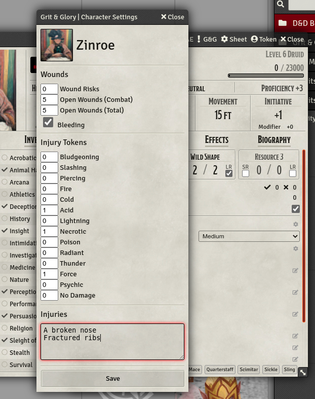

# ALPHA SOFTWARE

This module is in alpha.

Please don't be upset if things change in the future and it breaks.

# Required Modules

- MidiQOL
- Libwrapper

# Grit and Glory

This module aims to implement features from Grit & Glory. Currently it supports only the Wounds subsystem.

Find out more at [Reddit](https://www.reddit.com/r/gritandglory5e/comments/empff0/grit_and_glory_v6_100_pages_of_dd_5e_rules_for/)

## Wounds

In the Grit & Glory module settings enable Wounds.

They will only be calculated if __in combat.__

You can see the current state of your character clicking on the G&G button on their character sheet taskbar:

# Injuries

Injuries are not auto-rolled and added to the character sheet. You will need to do this manually.

# Known Issues

- Hit Dice spending to remove wound tokens is not yet triggered during rests.
- Injury tokens are not auto generated in the following situations:
  - You fall unconscious due to damage or Open Wounds.
  - You suffer a critical hit and the attacker can repeat the same attack roll and the result is still a hit.
